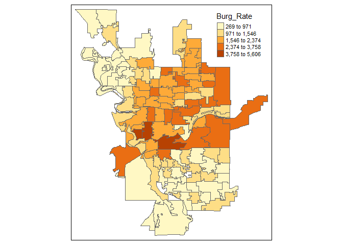

Geog 4/6300: Lab 3
================

## Spatial statistics and visualization

**Value:** 30 points

**Overview:** This lab has three main sections: mapping point patterns,
calculating rates and location quotients, and quadrat analysis. Your
answers to the lab questions should be typed in the relevant spaces
below and pushed to your Github repo.

\#\#\#Part 1: mapping the data and its distribution\#\#\# The data
folder has two files related to crime data for Spokane, Washington.

  - “Spokane\_crimes\_all” has data for every crime committed in from
    2000-2015.

  - “Spokane\_precincts” has precinct boundaries for the city of Spokane
    and its population 2015. This is saved as a geojson file.

In the first section of this lab, you’ll load this data and analyze it
using several metrics related to point pattern analysis.

**Question 1 (3 points)** *Load the crime reports (Spokane\_crimes\_all)
file using read\_csv. Then use st\_read to import the precinct
boundaries. Call the head of the Spokane\_crimes\_all file using kable
when you are done.*

``` r
spokane_crimes_all <- read_csv("data/Spokane_crimes_all.csv")
```

    ## Parsed with column specification:
    ## cols(
    ##   Offense = col_character(),
    ##   Month = col_double(),
    ##   Date = col_double(),
    ##   Year = col_double(),
    ##   Long = col_double(),
    ##   Lat = col_double()
    ## )

``` r
precincts_spok <- st_read("data/Spokane_precincts.geojson")
```

    ## Reading layer `Spokane_precincts' from data source `C:\Users\samsh\OneDrive\Documents\Productivity\College\GEOG4300 Data Science in GIS\Lab 2\geog4-6300-lab2-PhishRfriends\data\Spokane_precincts.geojson' using driver `GeoJSON'
    ## Simple feature collection with 117 features and 2 fields
    ## geometry type:  MULTIPOLYGON
    ## dimension:      XY
    ## bbox:           xmin: -117.5215 ymin: 47.5871 xmax: -117.3039 ymax: 47.7588
    ## geographic CRS: WGS 84

``` r
kable(head(spokane_crimes_all))
```

| Offense            | Month | Date | Year |       Long |      Lat |
| :----------------- | ----: | ---: | ---: | ---------: | -------: |
| Vehicle Theft      |     1 |    1 | 2008 | \-117.3867 | 47.66856 |
| Theft              |     1 |    1 | 2008 | \-117.4382 | 47.65373 |
| Malicious Mischief |     1 |    2 | 2008 | \-117.3653 | 47.69429 |
| Burglary           |     1 |    3 | 2008 | \-117.3644 | 47.63019 |
| Theft              |     6 |   11 | 2007 | \-117.3992 | 47.70969 |
| Drugs              |     1 |    3 | 2008 | \-117.4355 | 47.67083 |

**Question 2 (3 points):** *Filter the data to include just arson,
assault, and vehicle theft. Use group\_by and summarise to calculate the
mean centers for each type of offense. Then use ggplot and geom\_point
to plot these points on a graph, changing the color based on the
offense.*

``` r
AR_AS_VT_rate<- spokane_crimes_all%>%
  group_by(Offense)%>%
   filter(Offense == "Arson" | Offense == "Assault" | Offense == "Vehicle Theft")%>%
  
# Use long and lat data to calculate the mean center:
# This is done by taking the sum of all the latitude values and then dividing by the count of the latitude column. The same thing is repeated in the Y direction - All values in the longitude column are summed and then divided by the count of observations in that column. The values are recorded and saved as two SEPERATE and new variable. Once those variables have been created, the two columns can be joined together to form a final variable that contains the the specific coordinate information.
  
  summarise(mean_cent_X = mean(Long), 
            mean_cent_Y = mean(Lat))
```

    ## `summarise()` ungrouping output (override with `.groups` argument)

``` r
ggplot(data = AR_AS_VT_rate, aes(x = mean_cent_X, y = mean_cent_Y, color = Offense))+
  geom_point()+
  xlab("Longitude")+
  ylab("Latitude")
```

<!-- -->

**Question 3 (2 points)** *Interpret how geographic differences between
the mean centers you calculated are meaningful. What do they tell you
about the locations of these crimes?*

{The difference in mean center is directly affected by the spatial
components used in its calculation. Due to that fact, the disparity in
mean center between the three variables may be indicative of a
overarching geographic factor. An example of this might be with regards
to the vehicle theft mean center. That mean center may be located where
it is because the geographic area that surrounds may be particularly
suceptible to car thefts because it’s a high income area, potentially.
This data gives us an idea that particular crimes or types of crimes may
traceback to particular geographic locations in higher proportions when
compared to the number of equivalent crimes in a different geographic
area.}

**Question 4 (3 points):** *Filter the crime reports so that it contains
just murder as the offense type, and then use st\_as\_sf to convert
these to spatial data. Using tmap, create a map that shows the location
of all reports in the this data frame and the precinct boundaries. Also
include a scale bar and north arrow. See class scripts for a model to
work from.*

``` r
murder_reports <- spokane_crimes_all%>%
  filter(Offense == "Murder")
murder_reports_sf <- st_as_sf(murder_reports,
                              coords=c(x = "Long", y = "Lat"),#indicate coordinate columns
                              crs=4326, #Set the projections
                              remove=FALSE) #Keep the coordinate columns


pre_murd_join<-murder_reports_sf%>%
  st_join(precincts_spok, join = st_within)
```

    ## although coordinates are longitude/latitude, st_within assumes that they are planar

``` r
#my_bbox<-c(xmin=min(murder_reports_sf$Long),
#           ymin=min(murder_reports_sf$Lat),
#           xmax=max(murder_reports_sf$Long),
#           ymax=max(murder_reports_sf$Lat))

#murder_rep_map <- precincts_spok%>%
#  st_crs(murder_rep_map) = 4326
#  st_join(murder_reports_sf)

tmap_mode("plot")
```

    ## tmap mode set to plotting

``` r
tm_shape(precincts_spok)+
  tm_polygons()+
  tm_shape(pre_murd_join)+
  tm_dots(size = 0.1, alpha = 0.5, col = "red")+
tm_compass(position=c("right", "top"))+
tm_scale_bar(position="left")+
tm_legend(legend.outside=TRUE)
```

<!-- -->

``` r
#ggplot(pre_murd_join)+
 # geom_sf()
```

**Question 5 (2 points):** *The st\_as\_sf function has multiple
parameters (such as `coords`). Briefly explain the purpose of each one
you used for question 4.*

{The first argument included inside of the st\_as\_sf function specifies
the data set to use. The second argument establishes where the
coordinates needed to construct the right geometry are supposed to come
from - in this case, the Longitude column from the df in question
\[murder\_reports\] represents the x value data and the latitude
corresponds to what will become the y values. The third argument of the
st\_as\_sf function “crs” details what map projection when constructing
the map. The final argument details whether to keep the columns
detailing the original coordinate information or not; “TRUE” causes the
original columns to be removed since their geometry has been reported in
a new column. If remove=FALSE, then the original columns that contained
the coordinate information will me kept.}

\#\#\#Part 2: Crime rates\#\#\# In the second section of this lab,
you’ll do a spatial join of points to precincts to identify the
precinct ID of each reported crime. You’ll then summarise these reports
to create a crime rate for each precinct, which is usually reported as
crime per 100,000 people.

**Question 6 (3 points):** *Link the crimes from 2012 to the precinct
they were in. To do this, first filter the points based on year and then
match points to their precinct using a spatial join. Use st\_as\_sf to
convert the crime reports to spatial data. Then use st\_join to link
precinct information to the crime reports. When that’s done, remove the
geometry column using st\_set\_geometry and then filter out any points
that do not have a matching precinct. Call the head of this table using
kable when you are done.*

``` r
crimes_2012<-spokane_crimes_all%>%
  filter(Year=="2012")%>%
  st_as_sf(coords=c(x = "Long", y = "Lat"), 
           crs=4326,
           remove=TRUE)

crimes_2012_joint<-crimes_2012%>%
  st_join(precincts_spok)%>%
  st_set_geometry(NULL)%>%
  na.omit(crimes_2012_joint)
```

    ## although coordinates are longitude/latitude, st_intersects assumes that they are planar
    ## although coordinates are longitude/latitude, st_intersects assumes that they are planar

``` r
kable(head(crimes_2012_joint))
```

| Offense            | Month | Date | Year | Precinct | totpop |
| :----------------- | ----: | ---: | ---: | :------- | -----: |
| Malicious Mischief |     1 |    1 | 2012 | 3148     |   3969 |
| Burglary           |     1 |    1 | 2012 | 3148     |   3969 |
| Vehicle Prowling   |     1 |    1 | 2012 | 3119     |   1505 |
| Theft              |     1 |    1 | 2012 | 3106     |   1601 |
| Malicious Mischief |     1 |    1 | 2012 | 3104     |   2089 |
| Assault            |     1 |    2 | 2012 | 3150     |   1374 |

**Question 7 (3 points):** *Next, make a table of *crime rates*. To do
so, create a summary table showing counts of each type of offense by
precinct in these data using group\_by and summarise, grouping by
precinct number, population, and offense type. Spread the data to wide
format with the Offense types as column names and the count of reports
as observations. Use kable to show the head of this table when done.*

``` r
#crime_by_loc<-st_as_sf(spokane_crimes_all,
 #                             coords=c(x = "Long", y = "Lat"), 
  #                            crs=4326,
   #                           remove=FALSE)
 # st_join(precincts_spok)

c_rates<-crimes_2012_joint%>%
  group_by(Precinct, Offense, totpop)%>%
 # summarise(c_rates, offense_count = count("Offense")/totpop)%>% #tricky line to write...
  summarise(count=n())
```

    ## `summarise()` regrouping output by 'Precinct', 'Offense' (override with `.groups` argument)

``` r
c_rates_wide<-pivot_wider(c_rates, names_from = Offense, 
              values_from = count,
              values_fill = 0)
 
  
kable(head(c_rates_wide))
```

| Precinct | totpop | Assault | Burglary | Drugs | Malicious Mischief | Murder | Theft | Vehicle Prowling | Vehicle Theft | Robbery | Arson |
| :------- | -----: | ------: | -------: | ----: | -----------------: | -----: | ----: | ---------------: | ------------: | ------: | ----: |
| 3100     |   1996 |      31 |       75 |     5 |                 62 |      1 |    44 |               54 |            34 |       0 |     0 |
| 3101     |   1514 |      50 |       46 |     7 |                 43 |      1 |    62 |               24 |            24 |       2 |     0 |
| 3102     |   1814 |      44 |       30 |    11 |                 53 |      0 |    58 |               34 |            41 |       6 |     0 |
| 3103     |   2134 |      44 |       33 |    10 |                 80 |      0 |    72 |               54 |            32 |       3 |     0 |
| 3104     |   2089 |      56 |       38 |     3 |                 79 |      0 |    29 |               60 |            41 |       2 |     0 |
| 3105     |   1611 |      19 |       30 |     5 |                 37 |      0 |    30 |               25 |            23 |       3 |     0 |

**Question 8 (2 points)** *Select just the precinct number, population,
and burglary rate from the precincts data frame. Then calculate the
*burglary rate*, dividing the crimes by the population and multiplying
by 100,000. Create a histogram using ggplot showing the distribution of
this new variable.*

``` r
burg_rate<-c_rates_wide%>%
  select(Precinct, totpop, Burglary)%>%
  summarise(Burg_Rate = (Burglary/totpop)*100000)
```

    ## `summarise()` ungrouping output (override with `.groups` argument)

``` r
ggplot(burg_rate, aes(x = Burg_Rate))+
  geom_histogram()+
  xlab("Burglary")+
  ylab("Count")
```

    ## `stat_bin()` using `bins = 30`. Pick better value with `binwidth`.

<!-- -->

**Question 9 (2 points)** *Use left\_join to join the precinct
boundaries and burglary rate data frame. Then use tmap to create a map
of the burglary rate. Use style=“jenks” in the tm\_polygons function to
use natural breaks classifciation. What’s one geographic trend you see
on this map?*

``` r
burg_rate_join<-precincts_spok%>%
  left_join(burg_rate)
```

    ## Joining, by = "Precinct"

``` r
tm_shape(burg_rate_join)+
  tm_polygons("Burg_Rate", style = "jenks")
```

<!-- -->

{The areas from the center up thru the northern part of the city appear
to have more burglaries than the south-side of the the city. The center
of the city appears to have the worst rates of burglary.}

**Question 10 (3 points)** *The burglary rate for the city of Spokane in
2012, according to this dataset, is 1,657 per 100,000 residents. Using
this figure, calculate the location quotient for burglary in each
precinct within the city. Which precincts have the highest and lowest
location quotients? What does this tell you about each of those
precincts?*

``` r
burg_lq<-burg_rate_join%>%
  mutate(burg_lq = Burg_Rate/1657)

kable(head(burg_lq))
```

| Precinct | totpop | Burg\_Rate | geometry                     |  burg\_lq |
| :------- | -----: | ---------: | :--------------------------- | --------: |
| 3100     |   1996 |   3757.515 | MULTIPOLYGON (((-117.3472 4… | 2.2676615 |
| 3101     |   1514 |   3038.309 | MULTIPOLYGON (((-117.3708 4… | 1.8336205 |
| 3102     |   1814 |   1653.804 | MULTIPOLYGON (((-117.3824 4… | 0.9980711 |
| 3103     |   2134 |   1546.392 | MULTIPOLYGON (((-117.3816 4… | 0.9332479 |
| 3104     |   2089 |   1819.052 | MULTIPOLYGON (((-117.3816 4… | 1.0977985 |
| 3105     |   1611 |   1862.197 | MULTIPOLYGON (((-117.3848 4… | 1.1238367 |

``` r
#LOCATION QUOTIENT CALCULATION
```

{The location quotient tells us how the crime rate that corresponds to a
particular precinct area compares to the overall burglary rate for the
city. Precincts of particularly high traffic for an offense can be
analyzed more closely to see why that may be.}

\#\#\#Part 3: Kernel density analysis\#\#\# The last section of the lab
asks you to create a kernel density map of burglaries.

**Question 11 (2 points)** *Create a new data frame from the original
crime reports with just reported burglaries. Then create a ppp version
of these data in the spatstat package using the methods shown in class.
Plot this object to show the points.*

``` r
burg_only<-spokane_crimes_all%>%
  filter(Offense == "Burglary")

minlong<-min(burg_only$Long)
minlat<-min(burg_only$Lat)
maxlong<-max(burg_only$Long)
maxlat<-max(burg_only$Lat)

burg_ppp<-ppp(burg_only$Long,burg_only$Lat,c(minlong,maxlong),c(minlat,maxlat))
```

    ## Warning: data contain duplicated points

``` r
plot(burg_ppp)
```

<!-- -->

**Question 12 (2 points)** *Create a kernel density map for burglaries
in Spokane during the study period using spatstat using a kernel size
that you believe best shows the distribution of reported crime.*

``` r
kernel_map<-density(burg_ppp)
plot(kernel_map)
```

<!-- -->

``` r
plot(density(burg_ppp,0.008))
```

<!-- -->
